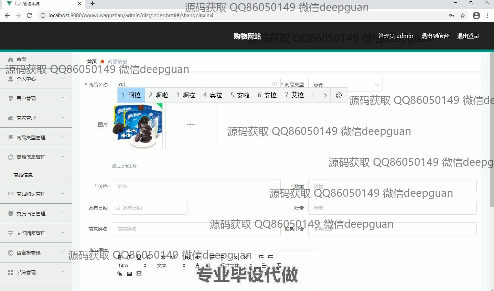

<h1 align="center">框架的购物网站+vue</h1>

## 简介
购物网站系统：角色分为管理员、商家和用户；功能包含用户管理、商品管理、商家管理、订单管理、信息反馈、以及多种商品和用户互动模块，适合后台数据管理和展示。    --计算机毕业设计源码；毕设源码；java毕业设计源码

## 联系方式

<h3 align="center">获取完整代码与数据库文件 + 微信：deepguan QQ: 86050149 QQ群: 783742310</h3>

<h3 align="center">可帮忙远程部署 包运行成功！提供远程部署、修改代码、设计文档指导、代码讲解等服务！</h3>

## 功能介绍（完整见运行截图）
管理员：基本功能包括登录、注册、退出，以及管理各类信息。网站后台支持个人信息修改、用户管理、商品管理、订单管理和商家信息管理等功能模块。商品管理功能提供查看、修改、删除和新增商品信息的操作，包括上传商品图片、设置价格和描述。管理员还可以管理商品分类和处理用户提交的反馈意见，并可根据商品名称和类型进行筛选查询。系统支持权限切换，方便管理员进行高效的用户和商品信息综合管理。

用户：基本功能为登录、注册、退出。用户可以通过主导航栏访问首页、商品信息、商品资讯和个人中心等模块。商品页面提供列表展示、搜索和详细信息查看的功能，用户可以将商品加入购物车，进行结算和在线模拟付款。个人中心允许用户查看和修改个人信息、浏览我的订单和地址，并管理我的收藏。还可以通过留言反馈模块提交咨询内容。整体界面简洁，支持用户互动，提升购物体验。

## 运行截图

本代码来源于网络,仅供学习参考使用!

